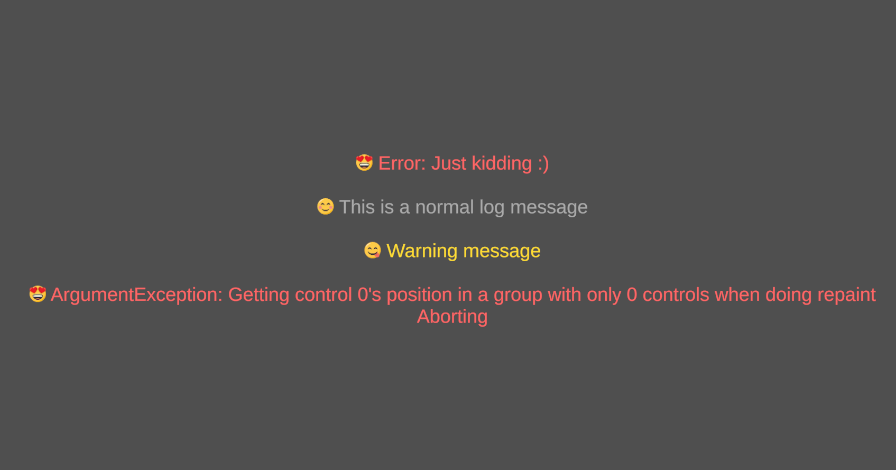
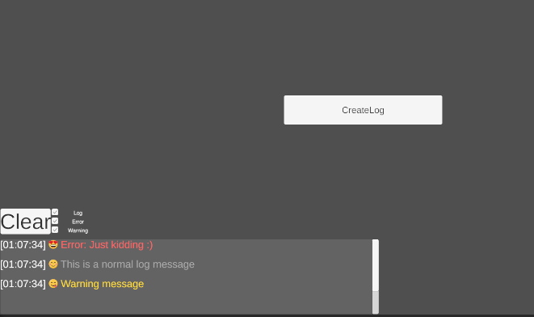

# Unity Logger Made 

### Example

### Actual Backend of logger 

### How to use
Drop and drag Logger prefab to your scene and use it and magic happens

It is support, 
* Clear
* Toggle
  * Info
  * Warning
  * Error
* View
  * Info
  * Warning
  * Error

